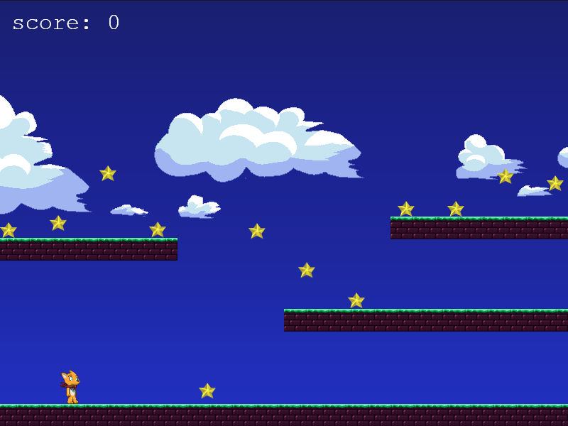

# Phaser Platform Game

This project is a platform game developed using Phaser, a framework for creating HTML5 games that can be played on desktop and mobile web browsers. The game supports both Canvas and WebGL rendering, providing a smooth gaming experience.

## Game Description

The objective of the game is to collect all the stars in the map while avoiding being hit by a bouncing ball. Once all the stars are collected, a little ball spawns and starts flying around the map, attempting to hit the player. The player must navigate the platform using arrow keys for movement and the space key for jumping.

## Installation and Setup

To run the game, please follow these instructions:

1. Install Node.js on your machine.
2. Open the terminal and navigate to the project folder.
3. Once you have the basic HTML structure and the necessary JavaScript files set up, execute the following command in the terminal: npx es-dev-server --node-resolve --watch
4. After executing the command, open your web browser and enter the following URL: http://localhost:8000/

This will launch the game in your browser, allowing you to play and enjoy the platform game.

## Resources

- [Phaser](https://phaser.io/): Official website of the Phaser framework.
- [Node.js](https://nodejs.org/): Official website for downloading Node.js.
